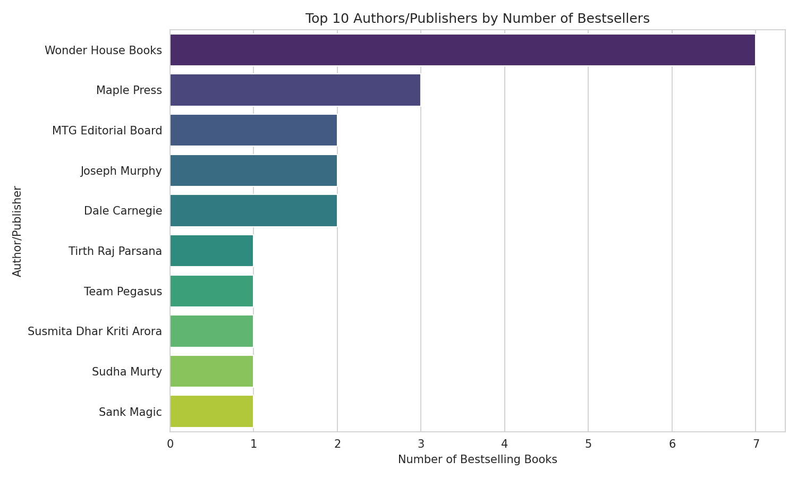

# Amazon Bestselling Books — Price & Rating Analysis

A SQL + Python data analysis project exploring pricing, ratings, and authors
of Amazon bestselling books.

## Overview
This project analyzes a dataset of Amazon bestselling books to answer
questions like: does price affect rating? Which authors and publishers
dominate the bestseller list? And along the way, uncovers a significant
data quality issue in the source file itself.

## Tools Used
- **SQL (SQLite)** — aggregation, filtering, and grouping queries
- **Python (pandas)** — data cleaning and analysis
- **Matplotlib / Seaborn** — data visualization
- **Google Colab** — development environment

## Key Findings

- **The dataset was 87.5% duplicate rows.** Of 400 original rows, only 50
  were unique books — every book was duplicated exactly 8 times. This was
  caught using `.duplicated().sum()` and corrected with `.drop_duplicates()`
  before any analysis was trusted. Because every book was duplicated
  evenly, overall averages (price, rating) were unaffected — but grouped
  counts (like "top authors") were significantly skewed until the fix.

- **Price has almost no relationship with rating.** Average rating stays
  within a narrow 4.40–4.50 range across every price bracket, from
  under ₹100 to ₹500+. Bestseller status and reader rating appear to be
  driven by factors other than price.

- **Some "authors" in the data are actually publishers.** Wonder House
  Books and Maple Press are listed as authors but are publishing houses
  behind multiple compiled titles (7 and 3 books respectively, after
  correcting for duplicates) — a labeling quirk worth noting rather than
  treating as individual authorship.

- **Correcting the duplicate issue changed headline numbers substantially.**
  Before cleaning, "Wonder House Books" appeared to have 56 bestsellers;
  after removing duplicates, the real number was 7 — an 8x difference
  that would have misrepresented the analysis if left uncaught.

## Charts

**Top 10 authors/publishers by number of bestsellers**

## Skills Demonstrated
- SQL: `CASE` statements, `GROUP BY`, aggregation, sorting
- Python: pandas for data cleaning, duplicate detection and removal
- Data quality: identifying and correcting duplicate records, string
  cleaning (currency symbols, thousands separators), type conversion
- Data visualization: matplotlib/seaborn, including deliberate axis
  scaling (`ylim`) to avoid visually overstating small differences

## How to Run
1. Download the bestsellers CSV dataset (Amazon Top Bestselling Books)
2. Open `amazon_bestsellers_analysis.ipynb` in
   [Google Colab](https://colab.research.google.com)
3. Run the upload cell and select the CSV when prompted
4. Run all remaining cells in order (**Runtime → Run all**)
5. Charts are saved as PNGs and can be downloaded directly from Colab

## Data Source
Amazon Top Bestselling Books dataset (Kaggle).

## License
This project is licensed under the MIT License — see the [LICENSE](LICENSE)
file for details.
